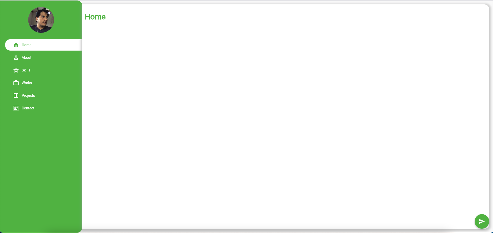

# Flutter Web Profile
This project was created as an example so that it can be a guide and help so that you have a base from which to start, animations and more. 

I placed the music because I wanted to make it more fun :D

### :heart: Star :heart: the repo to support the project. Thanks!

## Video Example

## ScreenShot

  
  

## Getting Started
This project is a starting point for a Flutter application.

A few resources to get you started if this is your first Flutter project:

- [Lab: Write your first Flutter app](https://flutter.dev/docs/get-started/codelab)
- [Cookbook: Useful Flutter samples](https://flutter.dev/docs/cookbook)

For help getting started with Flutter, view our
[online documentation](https://flutter.dev/docs), which offers tutorials,
samples, guidance on mobile development, and a full API reference.

Animation Glass: [flutterplasma](https://github.com/felixblaschke/flutterplasma/)